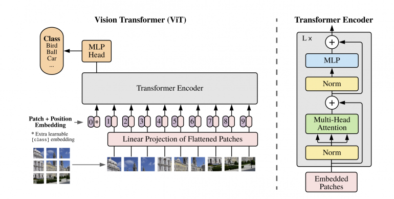

---

<div align="center">    
 
# TRES-Net   

[](https://arxiv.org/abs/2006.03677)

<!--
ARXIV   
[](https://arxiv.org/abs/2006.03677)
-->


</div>
 
## Description   
This is an implementation of a visual transformer.
I used resnet(50-101-152) as backbone to extract feature maps and tokens from the images.
The model converges very fast and reaches reasonable accuracy(95%++) on most publicly available small-medium datasets.


## How to run   
First, install dependencies   
```bash
# clone project   
git clone https://github.com/Zyarra/TRESNet

# install project
No installation, just the requirements.txt
pip install -r requirements.txt
 ```   
 Next, navigate to any file and run it.   
 ```bash
cd project

# run module (example: mnist as your main contribution)   
python tresnet.py *args **kwargs
```

## Imports
```python

# model
model = VTR()

# data
train, val, test = mnist()

# train
trainer = Trainer()
trainer.fit(model, train, val)

# test using the best model!
trainer.test(test_dataloaders=test)
```

